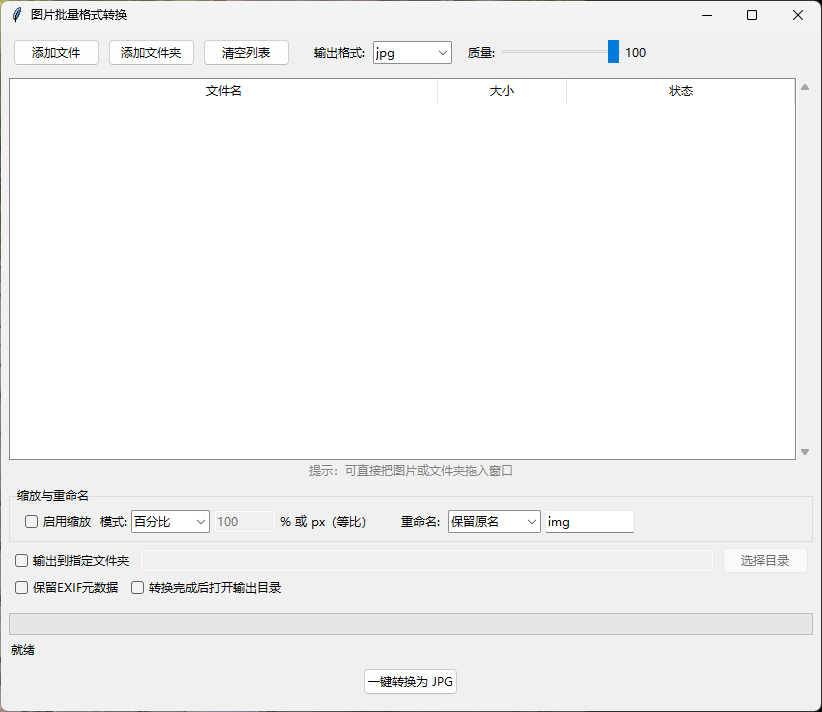

# 图片批量格式转换工具（Image2JPG）

本地运行的桌面小程序，**一键把各种图片格式批量转换为任意目标格式（默认 JPG）**。支持拖入、批量处理、等比缩放、重命名，完全本地运行，无需联网。

> 语言 / Language：**[中文](#中文) · [English](#english)**

---

<span id="中文"></span>

# 中文说明

本地运行的桌面小程序，**一键把各种图片格式批量转换为任意目标格式（默认 JPG）**。支持拖入、批量处理、等比缩放、重命名，完全本地运行，无需联网。

## 功能特性

- **拖入即转换**：可直接把图片文件或整个文件夹拖进窗口，也支持按钮添加
- **格式全覆盖（输入）**：jpg / jpeg / png / bmp / gif / webp / tiff / tif / ico / heic / heif（苹果设备照片）/ ppm / pgm / tga / avif 等主流位图
- **输出格式可选（9 种）**：`jpg`（默认）/ `png` / `webp` / `bmp` / `tiff` / `gif` / `ico` / `avif` / `heic`
- **一键批量**：点一次按钮，整批图片后台转换，带进度条与逐文件状态
- **等比缩放**：支持「百分比 / 最长边 / 宽度」三种模式，LANCZOS 高质量重采样
- **重命名**：支持「保留原名 / 加前缀 / 加后缀 / 序号」四种规则
- **透明自动处理**：目标不支持透明（jpg / bmp / gif）→ 透明区域以白色背景合成；支持透明的目标（png / webp / tiff / ico / avif / heic）→ 保留透明通道
- **方向自动校正**：手机照片按 EXIF 信息自动转正
- **质量可调**：jpg / webp / avif / heic 质量 10–100（默认 100）；无损格式自动忽略质量
- **保留 EXIF（可选）**：勾选「保留EXIF元数据」（或 CLI `--keep-exif`）后写回 JPG / WEBP / TIFF / HEIC 输出；开启时不自动按方向转正，以保留原始方向标签
- **转换完成自动打开目录（可选）**：勾选「转换完成后打开输出目录」（或 CLI `--open`）
- **输出可控**：默认输出到原图同目录；可勾选输出到指定文件夹

## 界面预览



## 运行方式

### 方式一：双击 exe（推荐，零环境依赖）

直接双击 `dist/Image2JPG.exe` 打开图形界面使用，无需安装 Python。

> 命令行请使用 `dist/Image2JPG-CLI.exe`（见「方式三」），它在当前终端直接输出，不会出现额外弹窗。

> AVIF / HEIC 输出已在打包时内置（已包含 `pillow-avif-plugin` 与 `pillow-heif`），无需额外安装。
> 注意：HEIC 在部分 Windows 自带「照片」查看器中无法直接预览，但主流看图/编辑软件均可正常打开。

### 方式二：源码运行（需 Python + Pillow + tkinter）

```bash
python -m venv .venv
.venv\Scripts\python.exe -m pip install -r requirements.txt
.venv\Scripts\python.exe image2jpg.py
# 命令行入口：
.venv\Scripts\python.exe image2jpg_cli.py input.png -f jpg -o out/
```

### 方式三：命令行（CLI）

适合在 PowerShell、脚本、CI 中直接调用，无需联网。

#### 用 exe 调用（推荐，零环境依赖）

```powershell
# 单文件 HEIC -> JPG
.\dist\Image2JPG-CLI.exe photo.heic -f jpg -q 90

# 批量：通配符 + 输出到 out 目录
.\dist\Image2JPG-CLI.exe *.png -f webp --output out\

# 整个目录递归转换，并缩放最长边到 1920、前缀重命名
.\dist\Image2JPG-CLI.exe D:\photos\ -f jpg --resize maxedge:1920 --rename prefix:conv_

# 保留原始 EXIF（JPG/WEBP/TIFF/HEIC 输出生效，且不会自动转正）
.\dist\Image2JPG-CLI.exe D:\photos\ -f jpg --keep-exif

# 转换完成后自动打开输出目录
.\dist\Image2JPG-CLI.exe D:\photos\ -f png --open

# 以 JSON 输出结果，便于程序解析
.\dist\Image2JPG-CLI.exe D:\photos\ -f png --json
```

#### 用 Python 源码调用

```bash
.venv\Scripts\python.exe image2jpg_cli.py input.png -f jpg -o out/
```

#### 参数一览

| 参数 | 说明 |
|------|------|
| `inputs`（可多个） | 图片文件、目录或通配符；目录默认递归；查询选项时不必填 |
| `-f, --format` | 输出格式，默认 `jpg`（可选 jpg/png/webp/bmp/tiff/gif/ico/avif/heic） |
| `-q, --quality` | 有损格式质量 1–100，默认 100 |
| `-o, --output` | 输出目录（默认源文件同级） |
| `-r / --no-recursive` | 目录是否递归扫描（默认递归） |
| `--resize MODE:VALUE` | 等比缩放：`percent:50` / `maxedge:1920` / `width:800` |
| `--rename MODE[:TEXT]` | 重命名：`prefix:IMG_` / `suffix:_x` / `sequence:page` / `keep` |
| `--overwrite` | 覆盖已存在的输出文件 |
| `--keep-exif` | 保留源图 EXIF 元数据（JPG/WEBP/TIFF/HEIC 生效；开启后不自动按方向转正） |
| `--open` | 转换完成后在资源管理器打开输出目录 |
| `--workers N` | 并行线程数（默认 1） |
| `--dry-run` | 只列出计划，不实际转换 |
| `--quiet` | 静默（仅输出错误） |
| `--json` | 以 JSON 输出结果汇总（便于机器解析） |
| `--list-formats` | 打印支持的输入/输出格式后退出 |

> 退出码：全部成功返回 `0`；有任意失败或无匹配输入返回 `2`。

## 使用步骤

1. 把图片/文件夹拖入窗口，或点「添加文件」「添加文件夹」
2. 选择「输出格式」（默认 jpg）；有损格式可拖动「质量」滑块
3. （可选）勾选「缩放与重命名」区的「启用缩放」，选模式填数值（% 或 px，等比）
4. （可选）在「缩放与重命名」区选「重命名」模式并填文本（序号模式会按列表顺序编号）
5. （可选）勾选「输出到指定文件夹」并选择目标目录
6. 点「一键转换为 XXX」，等待进度完成

## 文件说明

| 文件 | 作用 |
|------|------|
| `image2jpg.py` | GUI 主程序（tkinter），导出 `main_gui()`；打包为 `dist/Image2JPG.exe` |
| `image2jpg_cli.py` | 命令行逻辑，导出 `run_cli()`；打包为 `dist/Image2JPG-CLI.exe` |
| `convert_core.py` | 核心转换逻辑（无 GUI 依赖，可被单独测试/复用） |
| `test_convert.py` | 转换逻辑自测脚本（63+ 项：全格式 / 透明 / 缩放 / 重命名 / 自定义目录 / EXIF） |
| `dist/Image2JPG.exe` | GUI 程序：双击打开图形界面，无命令行窗口 |
| `dist/Image2JPG-CLI.exe` | CLI 程序：在当前终端输出 |

## 注意事项

- 不启用重命名时，输出文件名与原图同名（扩展名改为目标格式）。
- 若原图本身就是目标格式且输出到同一目录，会保存为 `<原名>_converted.<ext>`，避免覆盖原图。
- 已存在同名输出文件会被覆盖（视为上一次转换的残留产物）。
- 启用「序号」重命名后，文件名形如 `文本+三位序号`（如 `img001.jpg`），按列表顺序递增。
- 动图（GIF/WEBP）只取第一帧转换（静态目标格式不保留动画）。

## 开发者：重新打包

使用**本机完整 Python（含 tkinter）** 的 venv：

```bash
.venv\Scripts\python.exe -m pip install -r requirements.txt

# GUI 单文件 exe：双击打开图形界面，无命令行黑框
.venv\Scripts\pyinstaller.exe --windowed --onefile --name Image2JPG --hidden-import pillow_avif --hidden-import pillow_heif image2jpg.py

# CLI 单文件 exe：控制台子系统，在当前终端直接输出
.venv\Scripts\pyinstaller.exe --onefile --name Image2JPG-CLI --hidden-import pillow_avif --hidden-import pillow_heif image2jpg_cli.py
```

AVIF / HEIC 打包必须加 `--hidden-import pillow_avif --hidden-import pillow_heif`，否则打包后对应格式输出会因缺模块报错。

## 许可证

基于 MIT 许可证开源，详见 [LICENSE](LICENSE)。

---

<span id="english"></span>

# English

A local desktop app that **batch-converts images between formats with one click (default JPG)**. Supports drag-and-drop, batch processing, proportional resizing, and renaming. Runs 100% locally — no internet required.

## Features

- **Drag & drop**: drop image files or whole folders into the window, or add them with buttons
- **Full input coverage**: jpg / jpeg / png / bmp / gif / webp / tiff / tif / ico / heic / heif (Apple Photos) / ppm / pgm / tga / avif and other common bitmaps
- **9 output formats**: `jpg` (default) / `png` / `webp` / `bmp` / `tiff` / `gif` / `ico` / `avif` / `heic`
- **One-click batch**: convert a whole batch in the background with a progress bar and per-file status
- **Proportional resize**: percent / longest-edge / width modes, with high-quality LANCZOS resampling
- **Rename rules**: keep original / add prefix / add suffix / sequence numbering
- **Automatic transparency handling**: targets without alpha (jpg / bmp / gif) get a white background; alpha-capable targets (png / webp / tiff / ico / avif / heic) keep the alpha channel
- **Auto orientation**: phone photos are auto-rotated according to EXIF
- **Adjustable quality**: jpg / webp / avif / heic quality 10–100 (default 100); lossless formats ignore quality
- **Keep EXIF (optional)**: when "保留EXIF元数据" is checked (or CLI `--keep-exif`), EXIF is written back to JPG / WEBP / TIFF / HEIC output; auto-rotation is disabled so the original orientation tag is preserved
- **Auto-open output folder (optional)**: check "转换完成后打开输出目录" (or CLI `--open`)
- **Controllable output**: defaults to the source folder; can be redirected to a chosen folder

## Screenshot


## How to run

### Option 1: Double-click the exe (recommended, zero setup)

Double-click `dist/Image2JPG.exe` to open the GUI. No Python installation needed.

> For the command line, use `dist/Image2JPG-CLI.exe` (see "Option 3"). It prints directly to the current terminal with no extra popup.

> AVIF / HEIC output is bundled at build time (includes `pillow-avif-plugin` and `pillow-heif`), so no extra install is needed.
> Note: HEIC may not preview in some built-in Windows "Photos" viewers, but mainstream viewers/editors open it fine.

### Option 2: Run from source (requires Python + Pillow + tkinter)

```bash
python -m venv .venv
.venv\Scripts\python.exe -m pip install -r requirements.txt
.venv\Scripts\python.exe image2jpg.py
# CLI entry point:
.venv\Scripts\python.exe image2jpg_cli.py input.png -f jpg -o out/
```

### Option 3: Command line (CLI)

Best for PowerShell, scripts, and CI — no internet required.

#### Using the exe (recommended, zero setup)

```powershell
# Single file HEIC -> JPG
.\dist\Image2JPG-CLI.exe photo.heic -f jpg -q 90

# Batch: wildcard + output to out folder
.\dist\Image2JPG-CLI.exe *.png -f webp --output out\

# Recursively convert a folder, resize longest edge to 1920, prefix rename
.\dist\Image2JPG-CLI.exe D:\photos\ -f jpg --resize maxedge:1920 --rename prefix:conv_

# Keep original EXIF (applies to JPG/WEBP/TIFF/HEIC; disables auto-rotation)
.\dist\Image2JPG-CLI.exe D:\photos\ -f jpg --keep-exif

# Open the output folder automatically when done
.\dist\Image2JPG-CLI.exe D:\photos\ -f png --open

# Output results as JSON for programmatic parsing
.\dist\Image2JPG-CLI.exe D:\photos\ -f png --json
```

#### Using the Python source

```bash
.venv\Scripts\python.exe image2jpg_cli.py input.png -f jpg -o out/
```

#### Options

| Option | Description |
|--------|-------------|
| `inputs` (multiple) | Image files, directories, or wildcards; directories are scanned recursively by default; optional when querying options |
| `-f, --format` | Output format, default `jpg` (jpg/png/webp/bmp/tiff/gif/ico/avif/heic) |
| `-q, --quality` | Quality 1–100 for lossy formats, default 100 |
| `-o, --output` | Output directory (defaults to the source folder) |
| `-r / --no-recursive` | Whether to scan directories recursively (default: yes) |
| `--resize MODE:VALUE` | Proportional resize: `percent:50` / `maxedge:1920` / `width:800` |
| `--rename MODE[:TEXT]` | Rename: `prefix:IMG_` / `suffix:_x` / `sequence:page` / `keep` |
| `--overwrite` | Overwrite existing output files |
| `--keep-exif` | Keep source EXIF metadata (JPG/WEBP/TIFF/HEIC; disables auto-rotation) |
| `--open` | Open the output folder in Explorer when done |
| `--workers N` | Parallel worker threads (default 1) |
| `--dry-run` | List the plan only, do not convert |
| `--quiet` | Quiet mode (errors only) |
| `--json` | Emit a JSON summary (for machine parsing) |
| `--list-formats` | Print supported input/output formats and exit |

> Exit codes: `0` on full success; `2` if any file failed or no input matched.

## Usage steps

1. Drag images/folders into the window, or click "添加文件" / "添加文件夹"
2. Pick the output format (default jpg); drag the quality slider for lossy formats
3. (Optional) Enable "启用缩放" in the resize/rename area, choose a mode and value (% or px, proportional)
4. (Optional) Choose a rename mode and enter text (sequence mode numbers files in list order)
5. (Optional) Check "输出到指定文件夹" and pick a target directory
6. Click "一键转换为 XXX" and wait for the progress to finish

## File reference

| File | Purpose |
|------|---------|
| `image2jpg.py` | GUI app (tkinter), exports `main_gui()`; built into `dist/Image2JPG.exe` |
| `image2jpg_cli.py` | CLI logic, exports `run_cli()`; built into `dist/Image2JPG-CLI.exe` |
| `convert_core.py` | Core conversion logic (GUI-free, unit-testable and reusable) |
| `test_convert.py` | Self-test script (63+ cases: all formats / transparency / resize / rename / custom dir / EXIF) |
| `dist/Image2JPG.exe` | GUI build: double-click to open, no console window |
| `dist/Image2JPG-CLI.exe` | CLI build: prints to the current terminal |

## Notes

- Without renaming, the output keeps the original base name (only the extension changes).
- If the source is already the target format and output is the same folder, it is saved as `<name>_converted.<ext>` to avoid overwriting the original.
- An existing output file with the same name is overwritten (treated as a leftover from a previous run).
- With sequence renaming, names look like `text+3-digit` (e.g. `img001.jpg`), incrementing in list order.
- Animated images (GIF/WEBP) use only the first frame (static targets do not keep animation).

## For developers: rebuild

Use a venv of your **full local Python (with tkinter)**:

```bash
.venv\Scripts\python.exe -m pip install -r requirements.txt

# GUI single-file exe: double-click to open, no console window
.venv\Scripts\pyinstaller.exe --windowed --onefile --name Image2JPG --hidden-import pillow_avif --hidden-import pillow_heif image2jpg.py

# CLI single-file exe: console subsystem, prints to the current terminal
.venv\Scripts\pyinstaller.exe --onefile --name Image2JPG-CLI --hidden-import pillow_avif --hidden-import pillow_heif image2jpg_cli.py
```

AVIF / HEIC builds require `--hidden-import pillow_avif --hidden-import pillow_heif`; otherwise the corresponding format fails at runtime due to a missing module.

## License

Open source under the MIT License, see [LICENSE](LICENSE).
